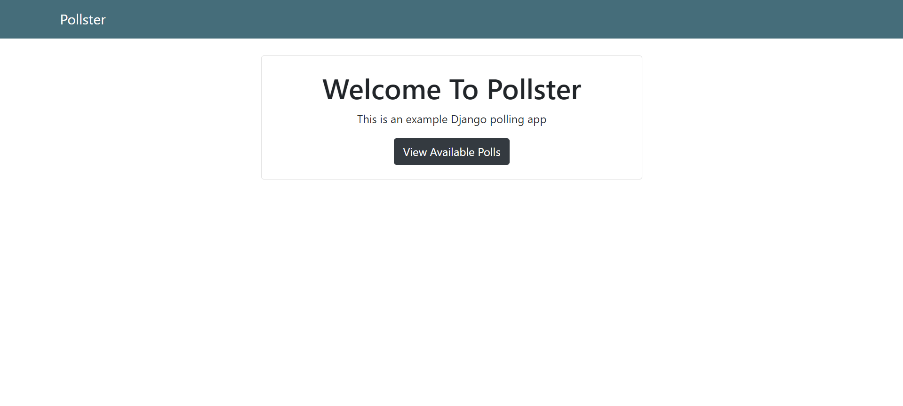
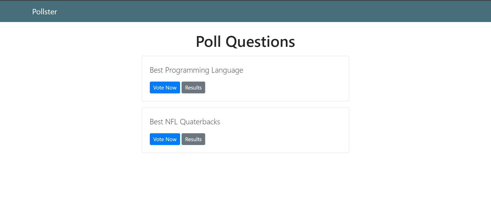
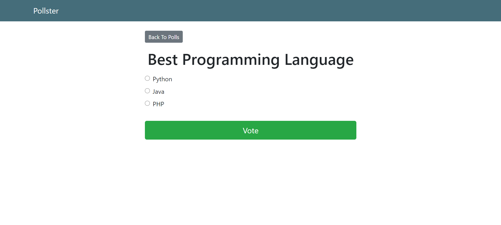
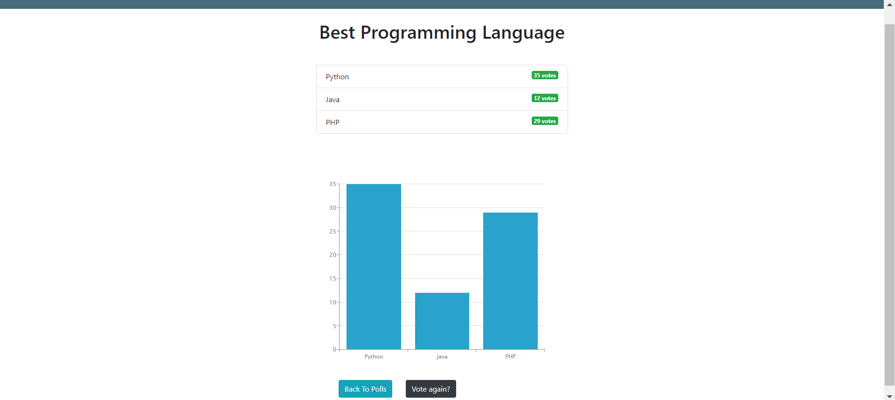

# VotingApp With Charts
*This is a Polling app with Charts developed using Django. A web based voting app that shows poll results in real time with charts.*

# Features
* Admin can create Questions and Answers.
* User can give the Answers.
* After Submitting Answers User can see the results.
* Also user can see the results on Charts.
* User-friendly.

# Tools
## Front-end Part
* HTML
* CSS
* Bootstrap
* JavaScript
## Back-end
* Django
* SQLite 3

# Screenshots of the Project

  
  
  
  

**Copyright (c)** 2020-3020 Md. Omar Faruk

## Go Through This Site Then You Will Know About This Site Properly.
